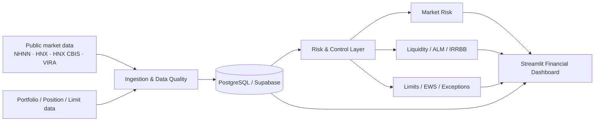

# Financial Risk Surveillance

**Market Risk · Liquidity Risk · ALM/IRRBB · Data Quality · Risk Control**

Portfolio project của **Tô Thanh Liêm** · GitHub **@toliem212**

> **Live application:** https://financial-risk-surveillance.onrender.com

## Tổng quan

`Financial Risk Surveillance` là hệ thống giám sát rủi ro tài chính được thiết kế theo luồng công việc của bộ phận Quản trị rủi ro thị trường và thanh khoản tại ngân hàng. Sản phẩm kết nối dữ liệu thị trường, dữ liệu danh mục và hạn mức để hình thành một chuỗi kiểm soát có thể giải thích và truy vết:

```text
Dữ liệu thị trường + danh mục/vị thế
→ Kiểm tra chất lượng dữ liệu
→ Đối soát Front Office – Risk
→ Định giá và đo lường rủi ro
→ Giám sát hạn mức và cảnh báo sớm
→ Kiểm định sức chịu đựng
→ Điều tra ngoại lệ
→ Báo cáo và truy vết
```

Mục tiêu của dự án là xây dựng một **financial data product có khả năng sử dụng**, thay vì chỉ trình bày các biểu đồ rời rạc hoặc một notebook định lượng.

## Phạm vi nghiệp vụ

| Nhóm | Nội dung chính |
| --- | --- |
| **Market Risk** | FX/NOP, VaR/ES, PV01/DV01, KR01/KRD, TPCP, FI-Bond, IRS/FRA, CCS, stress testing |
| **Liquidity / ALM / IRRBB** | Liquidity GAP, buffer, LCR/NSFR tham chiếu, concentration, survival horizon, ΔNII/ΔEVE |
| **Data Quality** | Missing, duplicate, stale, outlier, source mismatch, freshness và kiểm soát nguồn |
| **FO–Risk Reconciliation** | Đối soát giao dịch/vị thế, nhận diện sai lệch và lượng hóa tác động xuống chỉ tiêu rủi ro |
| **Limits / EWS / Exceptions** | Limit utilisation, cảnh báo sớm, breach, điều tra, chuyển cấp và audit trail |
| **Reporting** | Báo cáo ngày, báo cáo ngoại lệ, PDF/Excel và xem lại lịch sử theo thời điểm |

## Kiến trúc ở mức sản phẩm



Implementation chi tiết, crawler, schema SQL, Risk Engine và deployment secrets nằm trong repository PRIVATE và **không được công khai**.

## Nguồn dữ liệu

- **NHNN**: dữ liệu và thông tin điều hành liên quan tới tỷ giá, tiền tệ và thanh khoản khi nguồn công khai cho phép.
- **HNX / HNX CBIS**: dữ liệu TPCP và trái phiếu doanh nghiệp/tổ chức phát hành trong phạm vi portal công khai.
- **VIRA**: dữ liệu tham chiếu thị trường được sử dụng cùng metadata nguồn và ngày quan sát.
- **User-provided portfolio data**: CSV/Excel/Parquet hoặc nguồn cơ sở dữ liệu đã cấu hình.
- **Demo portfolio**: dữ liệu mô phỏng để trình diễn nghiệp vụ; luôn được phân biệt với dữ liệu thị trường bên ngoài.

## Nguyên tắc định lượng

- Không tự chuyển dữ liệu thiếu thành `0`.
- VaR/ES chỉ được tính khi chuỗi dữ liệu đủ điều kiện.
- PV01/DV01 và stress giữ nhất quán convention, đơn vị và dấu tác động.
- LCR/NSFR trong portfolio là lớp tính **tham chiếu quản trị**, không phải kết luận tuân thủ pháp lý của một ngân hàng cụ thể.
- IRRBB tập trung vào tác động **ΔEVE/ΔNII** và các giả định hành vi có thể giải thích.
- Cảnh báo/hạn mức được tách khỏi quyết định giao dịch; hệ thống phục vụ giám sát và kiểm soát.

Chi tiết hơn: [Methodology](docs/METHODOLOGY.md).

## Công nghệ

**Python · SQL · PostgreSQL/Supabase · Streamlit · Plotly · Pandas · NumPy · SciPy · statsmodels · scikit-learn · PyArrow · ReportLab · GitHub Actions**

Frontend ưu tiên Streamlit + Plotly và một design system thống nhất cho KPI, chart, bảng, heatmap, cảnh báo và responsive layout.

## Bảo mật và ranh giới public/private

Repository này là **portfolio đã sanitized**. Nó không chứa:

- source code ứng dụng thật;
- crawler/connector và pipeline ingestion;
- Risk Engine implementation;
- schema SQL và migration;
- credential, `.env`, service-role key hoặc connection string;
- raw user upload, database local hay dữ liệu nội bộ ngân hàng;
- cấu hình deploy của môi trường PRIVATE.

Một số đoạn code trong [`examples/`](examples/) được **viết lại tối giản để minh họa tư duy**, không phải implementation production.

## Screenshots

Ảnh portfolio sẽ được bổ sung từ bản deploy chính thức, ưu tiên 6–8 màn hình:

1. Tổng quan rủi ro
2. Rủi ro thị trường
3. Rủi ro thanh khoản và nguồn vốn
4. Đối soát FO–Risk
5. Hạn mức, cảnh báo và ngoại lệ
6. Báo cáo quản trị rủi ro
7. Chất lượng dữ liệu
8. Dữ liệu danh mục

Xem [Screenshot guide](docs/SCREENSHOT_GUIDE.md).

## Cấu trúc repository

```text
financial-risk-surveillance-portfolio/
├─ README.md
├─ docs/
│  ├─ ARCHITECTURE.md
│  ├─ METHODOLOGY.md
│  ├─ DATA_SOURCES.md
│  ├─ USE_CASES.md
│  ├─ SECURITY_AND_SCOPE.md
│  ├─ SCREENSHOT_GUIDE.md
│  └─ INTERVIEW_DEMO.md
├─ examples/
│  ├─ pv01_example.py
│  ├─ data_quality_example.py
│  └─ limit_monitor_example.py
└─ assets/screenshots/
```

## Trạng thái

Portfolio public được tách khỏi repository production để vừa cho phép nhà tuyển dụng xem kiến trúc, phương pháp và sản phẩm, vừa bảo vệ implementation có giá trị thương mại.

---

© 2026 Tô Thanh Liêm. Portfolio showcase. No license is granted to copy, redistribute or commercialize the implementation or derivative materials without permission.
