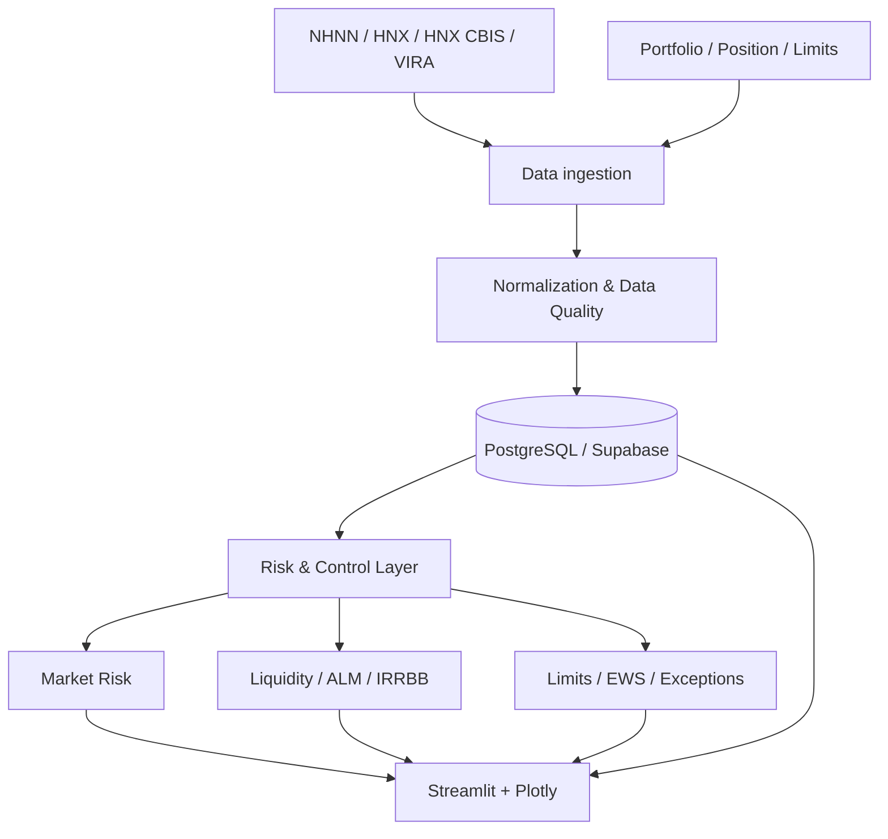

# Kiến trúc hệ thống

## Mục tiêu thiết kế

Kiến trúc được tổ chức để tách rõ bốn lớp: **dữ liệu**, **kiểm soát chất lượng**, **đo lường rủi ro** và **trình bày/giám sát**. Mỗi lớp có trách nhiệm riêng để kết quả có thể đối soát và truy vết.



## Nguyên tắc

- Nguồn dữ liệu và thời điểm quan sát được lưu cùng dữ liệu khi cần thiết.
- Missing, duplicate, stale và outlier được xử lý như trạng thái chất lượng dữ liệu, không bị che bằng fallback ngầm.
- Dữ liệu danh mục mô phỏng được tách khỏi dữ liệu người dùng.
- Risk Engine độc lập với lớp AI và lớp giao diện.
- Báo cáo và cảnh báo sử dụng cùng định nghĩa nghiệp vụ với dashboard để hạn chế lệch số.

## Deployment

Implementation production được giữ trong repository PRIVATE. Kiến trúc triển khai dự kiến:

```text
GitHub PRIVATE → Render Web Service → Streamlit application
       │
       └→ GitHub Actions → scheduled ingestion
                              │
                              ▼
                       PostgreSQL/Supabase
```

Repository public không chứa cấu hình chi tiết, secret hoặc schema production.
